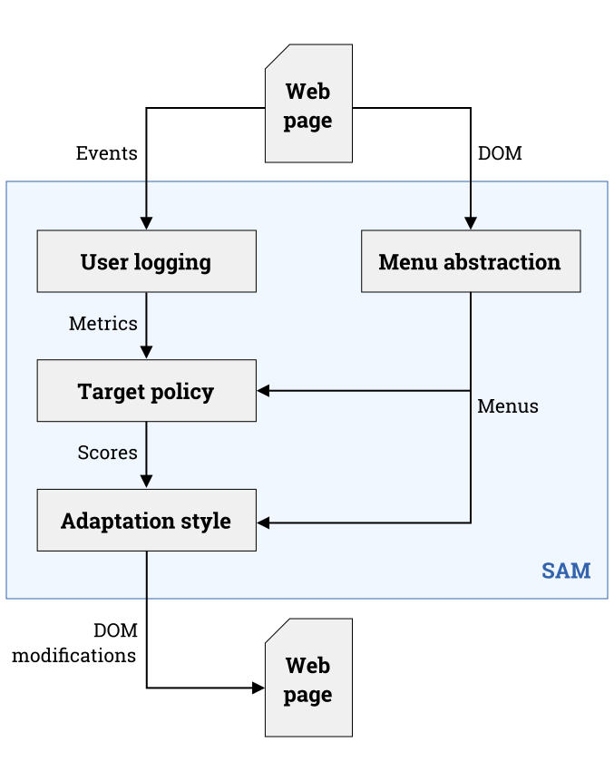

# Documentation of SAM

This document aims at presenting the global architecture and logic of SAM, along with some more specific tutorials covering important topics.
It naturally complements the formal documentation, which is available online.

## Structure of the project
SAM follows a rather classical project structure for JavaScript libraries using npm and git. In case your are not familiar with this type of structure, it is briefly described by the two following tables. The _Remote_ column indicate whether it should be pushed to the remote repository or not.

| Directory      | Description                                                                 | Remote |
|----------------|-----------------------------------------------------------------------------|--------|
| `build`        | Contains the build of the library.                                          | No.    |
| `doc`          | Contains the documentation generated by Typedoc.                            | No.    |
| `examples`     | Contains initialisation scripts for real webpages along with test webpages. | Yes.   |
| `node_modules` | Contains the dependencies managed by npm.                                   | No.    |
| `src`          | Contains the sources. One subdirectory per language.                        | Yes.   |

| File               | Description                                                        | Remote |
|--------------------|--------------------------------------------------------------------|--------|
| `DOCUMENTATION.md` | The current file.                                                  | Yes.   |
| `Gruntile.js`      | Configuration file of Grunt (the build system of SAM).             | Yes.   |
| `package.json`     | The description of the project and its dependencies for npm.       | Yes.   |
| `README.md`        | The document to display on the frontpage of the project on Github. | Yes.   |
| `tsconfig.json`    | Configuration file of tsc (the TypeScript compiler).               | Yes.   |

## SAM pipeline 
The logic of SAM is split in three complementary modules, which are used one after another in the adaptation pipeline. The following figure illustrates how do they relate to each other in the library pipeline.

* The **Menu abstraction** module is responsible for creating an abstract representation of the menus to adapt in a webpage, given jQuery selectors which target the DOM elements which constitute the menus.
* The **User logging** module is responsible for loading (on page load), recordering, turning into convenient metrics and saving (on page exit) some of the interactions between the user and the webpage.
* The **Menu adaptation** module is responsible for actually modifying the DOM to adapt the abstracted menus, given the history of interactions recorded by the User logging module.

## Menu abstraction

## User logging

## Menu adaptation

# Tutorials

## How to initialise SAM

## How to control the adaptation

## How to add a new style or policy

